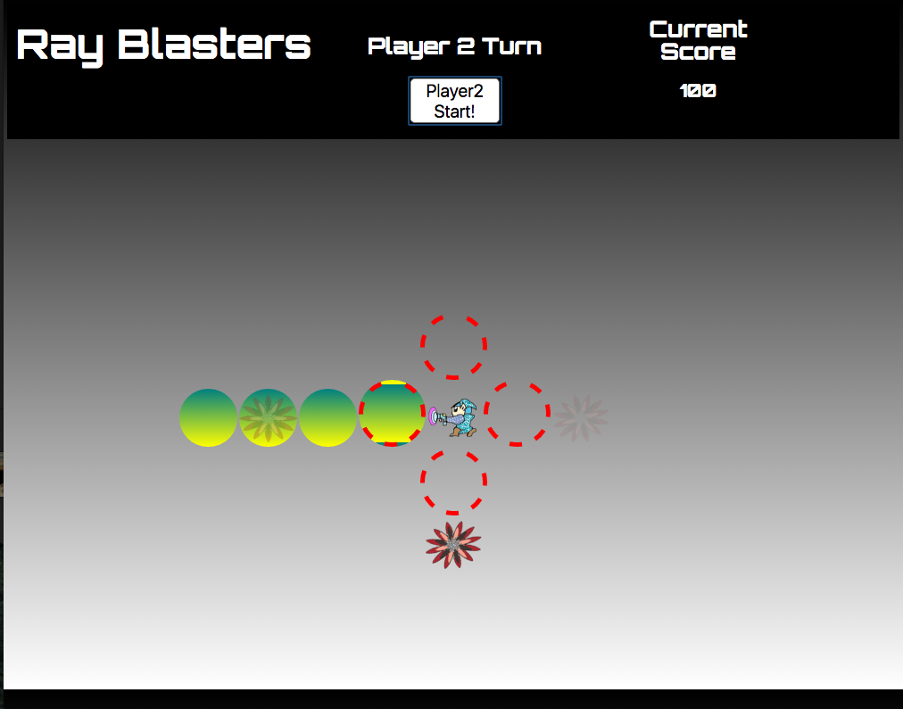

#RAY BLASTERS
--
###JavaScript-Based Survival Game

Two players will fight to the death, destoying evil space bugs for a chance at collecting the high score. Space-Cadets will be armed with nothing but their blaster guns, which will be operated by the users arrow keys. 

Each player will take turns holding off the bug monsters for as long as possible. The current player must press the corisponding arrow key at the exact time a enemy appears, to dissolve them. If missed, the monster will advance one step closer and grow more powerful. If the monsters reach the red dashed circles, your character will be terminated!

###Controls

Players can only fire their blasters horizontally or vertically with the arrow keys.

##To Play

Visit **[Insert Website Here]** to play, or simply download a .zip of this repo and open index.html in your browser.

##Development process

Technologies used: HTML / CSS / JavaScript / jQuery

