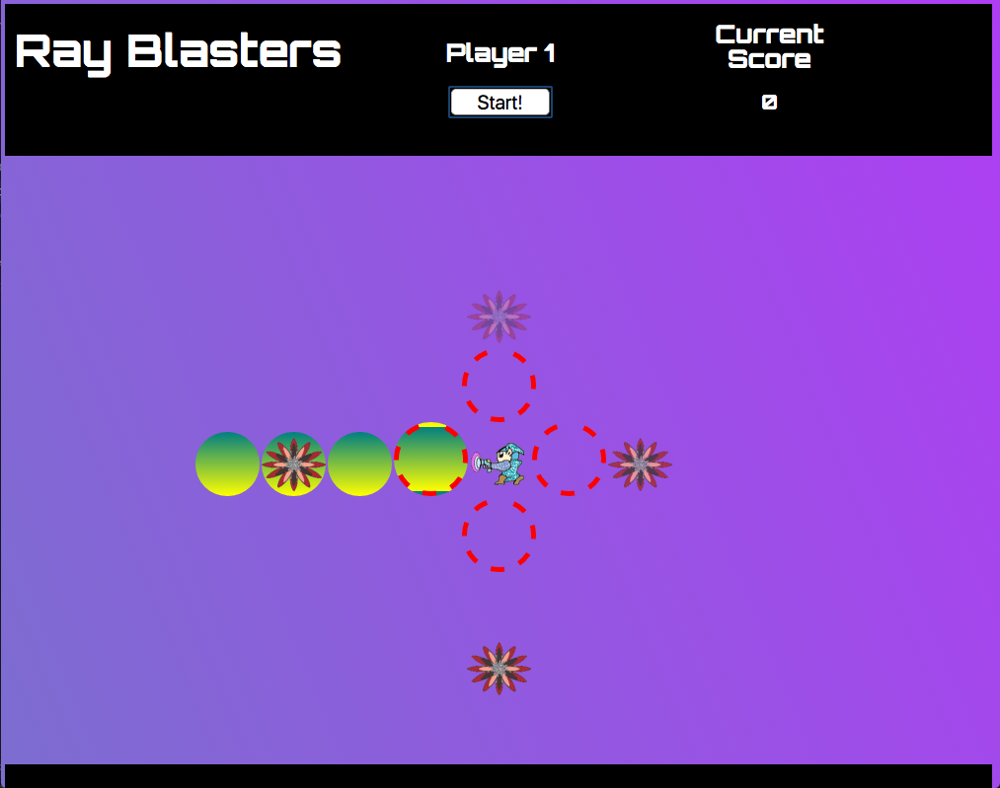

#RAY BLASTERS
--
###JavaScript-Based Survival Game

Two players will fight to the death, destoying evil space bugs for a chance at collecting the high score. Space-Cadets will be armed with nothing but their blasters, which will be operated by the users arrow keys. 

Each player will take turns holding off the bug monsters for as long as possible. The current player must press the corisponding arrow key at the exact time a enemy appears, to dissolve them and earn +100 points. If missed, the monster will advance one step closer and the current player loses 100 points. If the monsters reach the red dashed circles, your character will be terminated!

###Controls

Players can only fire their blasters horizontally or vertically with the arrow keys.

##To Play

Visit https://troycarson100.github.io/project1/ to play, or simply download a .zip of this repo and open index.html in your browser.

##Development process

Technologies used: HTML / CSS / JavaScript / jQuery

With the use of Div containers within JavaScript, enemies are generated at random speeds and are able to appear and disapear, getting closer to the player. Sprite animation was also utilized to give the enemies and hero movement throughout the game. 

CSS and jQuery help the animations remain fluid after re-spawning. 

##Not-Yet-Implemented
 * Make a mute button for all sound
 * Make new and exciting enemies
 * Make power-ups for players
 
##User Stories
 
 As a player, I can challenge friends and play quick games.
 
 As a player, I enjoy the background sound being on only during the loading screen.
 
 As a player, I like the scoring system. Having points deducted if I miss an enemy makes it impossible to rapidly press all my keys and cheat.
 

